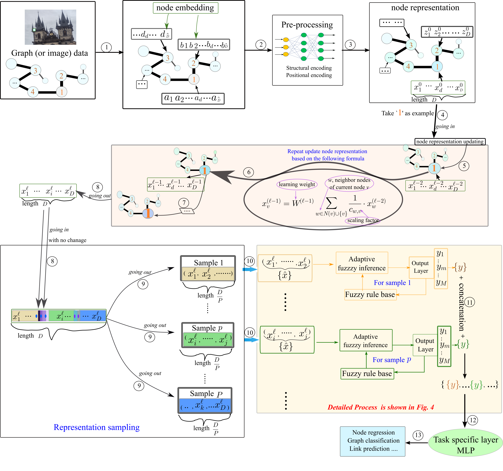

# Large-scale Data Classification based on the Integrated Fusion of Fuzzy Learning and Graph Neural Network

[](LINK TO PAPER)

python testrun.py --cfg configs/GPS/mnist-GPS1.yaml  wandb.use False




How to build a FuzzyGNN ? We provide a 4-part recipe on how to build graph Transformers with linear complexity. Our GPS recipe consists of choosing 3 main ingredients:
1. positional/structural encoding: [LapPE](https://arxiv.org/abs/2106.03893), [RWSE](https://arxiv.org/abs/2110.07875), [SignNet](https://arxiv.org/abs/2202.13013), [EquivStableLapPE](https://arxiv.org/abs/2203.00199)
2. local message-passing mechanism: [GatedGCN](https://arxiv.org/abs/1711.07553), [GINE](https://arxiv.org/abs/1905.12265), [PNA](https://arxiv.org/abs/2004.05718)
3. global attention mechanism: [Transformer](https://arxiv.org/abs/1706.03762), [Performer](https://arxiv.org/abs/2009.14794), [BigBird](https://arxiv.org/abs/2007.14062)
4. add fuzzy-assisted module.

In this *FuzzyGNN* we modified package from source [GraphGPS](https://github.com/rampasek/GraphGPS)
and [Anfis-pytorch](https://github.com/jfpower/anfis-pytorch)


### Python environment setup with Conda
 all process follows the procedure of [GraphGPS](https://github.com/rampasek/GraphGPS)
```bash


### Running GraphGPS
```bash
conda activate FuzzyGNN

# Running GPS with RWSE and tuned hyperparameters for ZINC.
python main_new.py --cfg configs/param/IMDB-BINARY-GENConv+Transformer-0-mix.yaml  wandb.use False

```


## Citation

If you find this work useful, please cite our paper:
```
bible citation is here
```
